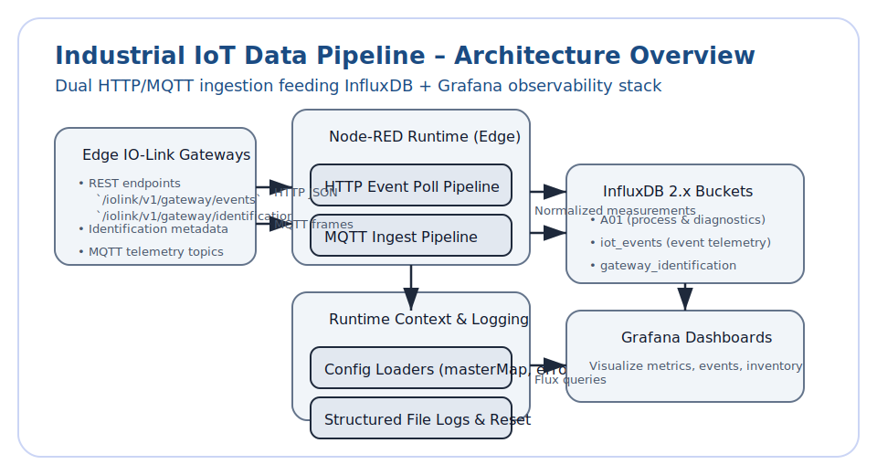

# Industrial IoT Data Pipeline – Architecture Guide

## 1. System Overview
The Node-RED flow provides dual-ingestion (HTTP polling + MQTT subscribe) to capture IO-Link gateway telemetry, normalize it with
 shared configuration, and persist it into dedicated InfluxDB buckets for visualization in Grafana. The design favors edge auton
omy—Node-RED runs near the gateways, buffering structured logs locally so operators can recover context without cloud connectivit
y.

## 2. Deployment Topology
| Layer | Components | Notes |
| --- | --- | --- |
| Field | IO-Link gateways exposing REST APIs and MQTT topics | Supply gateway IP ranges and credentials; firmware ≥ 1.7 tested. |
| Edge compute | Node-RED runtime with `node-red-contrib-influxdb` palette | Hosts the flow, configuration loaders, structured logging, and context store. |
| Data persistence | InfluxDB 2.x buckets `A01`, `iot_events`, `gateway_identification` | Receives normalized process data, event logs, and device inventory. |
| Visualization | Grafana dashboards under `docs/developer/examples/sample_configs/` | Dashboards query Flux from the three buckets. |

## 3. Core Flow Groups
1. **Configuration loaders** – Boot-time inject + file nodes load `config/errorCodes.json` into `global.errorMap` and `config/masterMap.json` into `flow.cfg`. These contexts power downstream enrichment.
2. **HTTP event polling** – Generates IP list, polls `/iolink/v1/gateway/events`, splits the payload, and uses Function v8 to normalize port IDs, derive event state, and enrich messages before writing to `iot_events`.
3. **Gateway identification poll** – Collects hardware metadata via `/iolink/v1/gateway/identification` and persists it into `gateway_identification` for inventory dashboards.
4. **MQTT ingest pipeline** – Subscribes to wildcard IO-Link topics, resolves aliases using `flow.cfg.pins`, and writes measurement points into bucket `A01`.
5. **Structured logging** – Mirrors HTTP/MQTT exchanges into JSON files (`01_GET_*.json`, `MQTT_raw_*.json`, etc.) with a scheduled reset inject for rotation.

See [`docs/architecture/data_flow.md`](docs/architecture/data_flow.md) for a detailed walkthrough.

## 4. Data Flow Summary
1. **HTTP path** – Inject → IP generator → HTTP request → response splitter → enrichment → InfluxDB `iot_events` bucket.
2. **MQTT path** – MQTT in node → router function → alias resolution → InfluxDB `A01` bucket.
3. **Identification path** – Inject → HTTP request → normalization → InfluxDB `gateway_identification` bucket.
4. **Logging path** – Tap nodes branch HTTP/MQTT payloads into file writers for offline diagnostics.

## 5. Configuration & Context
- `config/masterMap.json` defines alias mappings; loaded into `flow.cfg` to support MQTT routing and metric naming.
- `config/errorCodes.json` enumerates event codes; stored in `global.errorMap` so Function v8 can add human-readable context.
- JSON Schemas under `docs/developer/examples/sample_configs/schemas/` guard config changes; run `ajv-cli` via the commands in [`docs/user/install_guide.md`](docs/user/install_guide.md) to validate.

## 6. External Integrations
| Integration | Purpose | Configuration touchpoints |
| --- | --- | --- |
| MQTT broker (Mosquitto) | Streams process data | Configure MQTT config node with host, port, credentials; ensure wildcard subscriptions are permitted. |
| IO-Link REST endpoints | Source of event + identification data | Populate IP ranges + credentials in HTTP nodes; confirm TLS/HTTP requirements per gateway firmware. |
| InfluxDB 2.x | Metrics storage | Update the InfluxDB config node with URL, token, organization, bucket names. |
| Grafana | Visualization + alerting | Import dashboards from `docs/developer/examples/sample_configs/`; configure data source pointing at the InfluxDB organization and token. |

## 7. Security Considerations
- Scope InfluxDB tokens to write-only buckets used by the flow; manage secrets via environment variables or secure credential stores.
- Restrict MQTT topics with ACLs and use TLS if broker supports it; the flow handles username/password auth.
- Protect configuration dictionaries; when mounting overrides, enforce read-only permissions (e.g., `chmod 640`).
- Structured log files may contain sensitive payloads—store them in directories with restricted access and rotate regularly.

## 8. Reliability & Scaling
- HTTP polling interval defaults to 60 seconds; adjust inject node repeat settings per deployment needs.
- MQTT pipeline scales with topic volume; ensure the Node-RED instance has sufficient memory for bursty telemetry.
- For high availability, run redundant Node-RED instances with coordinated config mounts and deduplicate writes via Influx retention policies or measurement tags.
- Monitor log directories for disk usage; the **Log Reset** inject trims files on deploy but long-lived nodes may require cron-based rotation.

## 9. Reference Materials
- Flow modules: [`docs/architecture/module_graph.md`](docs/architecture/module_graph.md)
- Operational lifecycle diagram: [`docs/visuals/diagrams/pipeline_operations.svg`](docs/visuals/diagrams/pipeline_operations.svg)
- Release procedures: [`RELEASE.md`](RELEASE.md)
