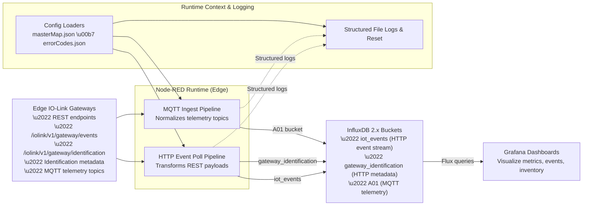

# Murr Elektronik Impact67 Pro IO Link Master IoT Data Pipeline

Production-ready Node-RED flows that collect IO-Link telemetry, enrich it with contextual metadata, and deliver normalized metrics to an InfluxDB + Grafana observability stack.

> **No Warranty or Liability** – Provided “as-is,” without warranty of any kind.

## Overview

* Dual ingestion paths (HTTP polling + MQTT subscribe) keep process metrics and gateway diagnostics in sync.
* Structured JSON logs mirror every stage for traceability and compliance.
* Reusable Grafana dashboards accelerate deployment across multiple facilities.

## Quickstart

1. Review the detailed installation steps in [`docs/user/install_guide.md`](docs/user/install_guide.md).
2. Import `src/flows/production/Influx_Data_Pipeline_v1.2.json` into Node-RED (**Menu → Import → Clipboard**).
3. Configure the InfluxDB and MQTT credentials, then deploy the flow.
4. Validate metrics using the Grafana templates under
   [`docs/developer/examples/sample_configs/`](docs/developer/examples/sample_configs/).

## Visual Reference

## Documentation Map

| Guide | Purpose |
| --- | --- |
| [`ARCHITECTURE.md`](ARCHITECTURE.md) | High-level system structure and integration map with references into `/docs/architecture/`. |
| [`USER_MANUAL.md`](USER_MANUAL.md) | Comprehensive operator guide covering setup, validation, and lifecycle tasks. |
| [`DEVELOPER_REFERENCE.md`](DEVELOPER_REFERENCE.md) | Contributor workflow, internal APIs, and testing requirements. |
| [`TROUBLESHOOTING.md`](TROUBLESHOOTING.md) | Symptom-driven diagnostics with recovery playbooks. |
| [`ROADMAP.md`](ROADMAP.md) | Milestones and planned releases. |
| [`CHANGELOG.md`](CHANGELOG.md) | Versioned history of shipped updates. |

Additional resources live under [`/docs`](docs/) and follow the structured layout described in [`ARCHITECTURE.md`](ARCHITECTURE
.md).

## Repository Layout

| Path | Description |
| --- | --- |
| `src/` | Production Node-RED exports and shared utilities. |
| `examples/` | Sanitized flow samples for demos and training. |
| `config/` | Configuration dictionaries consumed by the flows. |
| `tests/` | Validation utilities for flow JSON and schemas. |
| `docs/` | Supplemental documentation, diagrams, dashboards, and troubleshooting guides. |
