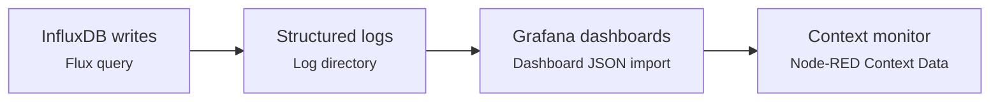

# Industrial IoT Data Pipeline – User Manual

## 1. Introduction
This manual walks operations engineers through deploying and operating the `Influx_Data_Pipeline_v1.2.json` Node-RED flow. It bu
ilds on the quick-start summary in [`docs/user/install_guide.md`](docs/user/install_guide.md) and focuses on day-to-day tasks: pr
eparing prerequisites, importing the flow, validating connectivity, and using the supplied observability tooling.

## 2. Audience & Prerequisites
- **Audience**: Plant-floor engineers, OT administrators, and support teams responsible for IO-Link telemetry collection.
- **Skills required**: Familiarity with the Node-RED editor, MQTT brokers (Mosquitto or equivalent), InfluxDB 2.x administration,
  and Grafana dashboard import.
- **Prerequisites**:
  - Node-RED ≥ 3.1 running near the IO-Link gateways.
  - `node-red-contrib-influxdb` palette installed.
  - InfluxDB 2.x instance with buckets `A01`, `iot_events`, and `gateway_identification` plus a token with write access.
  - Accessible MQTT broker with credentials.
  - Updated `config/masterMap.json` and `config/errorCodes.json` files from this repository or your production overrides.

## 3. Installation Workflow
1. **Copy configuration dictionaries** – Place `config/masterMap.json` and `config/errorCodes.json` on the Node-RED host (or moun
t overrides). Confirm file permissions allow the Node-RED service account to read them. To rehearse without production data, use
the sanitized dictionaries under `examples/config/v1.2/` which mirror the live schema but contain only demonstrative values.
2. **Import the flow** – In the Node-RED editor, choose `Menu → Import → Clipboard`, paste the contents of
   `src/flows/production/Influx_Data_Pipeline_v1.2.json`, and deploy to a dedicated tab. When you need a credential-free rehearsal,
   import `examples/flows/v1.2/sanitized_data_pipeline_v1.2.json`; it preserves node structure and comments from the matching release while removing environment secrets.
3. **Configure credentials** – Open the InfluxDB config node and supply URL, organization, token, and bucket names. Update MQTT config nodes with broker host, port, TLS, and credentials.
4. **Adjust file log paths** – If the default `E:\\NodeRed\\Logs` directory does not exist, edit the file nodes under HTTP/MQTT taps to point at a writable path.
5. **Deploy** – Click **Deploy**. The configuration injects run immediately, populating `global.errorMap` and `flow.cfg`. Confirm via **Menu → Context Data**.

## 4. Post-Deployment Validation
1. **Check InfluxDB writes** – Use the InfluxDB UI or `influx query` CLI to verify measurements arriving in `A01`, `iot_events`, and `gateway_identification` buckets.
2. **Inspect structured logs** – Review JSON files generated in the log directory (e.g., `01_GET_*.json`, `MQTT_raw_*.json`) to ensure HTTP and MQTT payloads are captured.
3. **Import Grafana dashboards** – Load dashboards from
   [`docs/developer/examples/sample_configs/`](docs/developer/examples/sample_configs/) to visualize pipeline health and gateway inventory.
4. **Monitor context** – In Node-RED, ensure `global.errorMap` and `flow.cfg` are populated and updating when config files change.

The following visual checklist reinforces how observability data flows between these checkpoints so teams can quickly orient themselves before diving into the tooling specifics.

## 5. Routine Operations
- **Scaling gateways** – Edit the `ranges` array in the `generate IPs` function node to add or remove gateway addresses.
- **Changing poll cadence** – Update the HTTP `trigger` inject repeat interval to tune load vs. freshness.
- **Rotating logs** – Trigger the **Log Reset** inject or schedule additional rotations if running continuously for long periods.
- **Updating configuration** – Modify the JSON dictionaries, validate them against schemas using the commands in
  [`docs/user/configuration.md`](docs/user/configuration.md), then redeploy the flow.

## 6. Maintenance Checklist
| Task | Frequency | Steps |
| --- | --- | --- |
| Validate configuration schemas | Before each deployment | Run `ajv-cli` commands listed in [`docs/user/install_guide.md`](docs/user/install_guide.md). |
| Review Grafana dashboards | Weekly | Confirm data freshness and investigate anomalies flagged by panels. |
| Refresh credentials | Per security policy | Update InfluxDB token and MQTT passwords in Node-RED config nodes; redeploy. |
| Trim log directory | Monthly or as needed | Rotate or archive structured logs to prevent disk exhaustion. |

## 7. Using the Example Assets
- **Locate versioned samples** – Each release has its own folder under `examples/`, such as `examples/flows/v1.2/` and `examples/config/v1.2/`. The suffix matches the flow tag (for example `v1.2`), ensuring the sample structure mirrors the production export for that release.
- **Practice imports safely** – Import the sanitized flow into a non-production Node-RED workspace to review wiring, context usage, and info panel guidance without touching live services. The sanitized flow retains Function logic but replaces credentials with neutral placeholders.
- **Validate customizations** – Copy the configuration samples to a scratch directory, adapt field names for your environment, then run the schema validation commands from the installation guide. Once validated, promote the modified dictionaries into `config/`.
- **Sync with new releases** – When a new tagged flow ships, pull the matching versioned folder so your rehearsal assets stay aligned with the production baseline.

## 8. Troubleshooting
- Refer to [`TROUBLESHOOTING.md`](TROUBLESHOOTING.md) for a symptom-driven guide.
- Use the operational lifecycle diagram (`docs/visuals/diagrams/pipeline_operations.svg`) to trace where a failure occurs in the pipeline.

## 9. Additional Resources
- Architecture context: [`ARCHITECTURE.md`](ARCHITECTURE.md)
- Developer workflow: [`DEVELOPER_REFERENCE.md`](DEVELOPER_REFERENCE.md)
- Recovery guides: [`docs/troubleshooting/recovery.md`](docs/troubleshooting/recovery.md)
- Release process for coordinated upgrades: [`RELEASE.md`](RELEASE.md)
