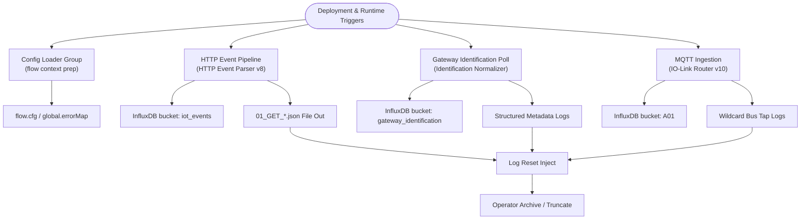

# Data Flow Overview

This document explains how telemetry, metadata, and diagnostics traverse the Industrial IoT data pipeline. The flow is implement
ed as a Node-RED project that runs on the shop-floor edge and bridges IO-Link gateways, MQTT brokers, and an InfluxDB + Grafana
observability stack.

Figure 1 provides a high-level visual that mirrors the narrative sections that follow.

*Figure 1. High-level Node-RED data flow highlighting startup, HTTP, MQTT, and structured logging branches.*

## Startup and Configuration Loading

1. The **Config Loader** group executes after deployment and on every scheduled refresh.
2. Configuration files `config/masterMap.json` and `config/errorCodes.json` are read from disk.
3. Gateway alias maps are stored on the `flow` context as `cfg`, while the error dictionary is placed on `global.errorMap`.
4. Downstream function nodes depend on these context objects to translate field names, normalize measurements, and resolve error
codes.

## HTTP Event Pipeline

1. A scheduler injects IO-Link gateway addresses (typically IPv4) into the HTTP poll sub-flow.
2. The `/iolink/v1/gateway/events` endpoint is queried for each address.
3. The **HTTP Event Parser (v8)** function normalizes port identifiers (`x0`–`x7`), produces event lifecycle markers (`event_star
t`, `event_stop`), and harmonizes timestamps.
4. Results are written to the InfluxDB bucket `iot_events`, ensuring dashboards can track alarm transitions and severity.
5. Structured JSON copies of the raw responses are appended to the `01_GET_*.json` log files for auditing.

## Gateway Identification Poll

1. A dedicated inject node calls `/iolink/v1/gateway/identification` on deployment and on the configured cadence.
2. The **Identification Normalizer** function extracts make, model, and firmware metadata.
3. Metadata is written to the `gateway_identification` bucket and exposed to Grafana dashboards.
4. Snapshots of the responses are appended to the structured log directory to simplify troubleshooting.

## MQTT Ingestion Pipeline

1. The MQTT client subscribes to wildcard topics that mirror IO-Link payloads (`+/iolink/v1/#`).
2. The **IO-Link Router (v10)** function looks up aliases from `cfg.pins` and flattens payloads into field/value pairs.
3. The normalized metrics are written to the InfluxDB bucket `A01`.
4. Bus taps forward wildcard traffic (`#`, `$SYS/#`) into dedicated log files. These captures accelerate debugging intermittent gat
eway issues.

## Structured Logging and Resets

* Each major pipeline includes a **File Out** branch that persists raw or normalized frames.
* A **Log Reset** inject truncates the structured log files on deploy or when triggered manually.
* Operators can archive the log directory before running resets to retain diagnostic snapshots for compliance.

## External Integrations

* **InfluxDB 2.x** stores normalized metrics, event history, and gateway inventories.
* **Grafana 12 OSS** dashboards consume InfluxDB data via Flux queries. Dashboard JSON templates are published under
  `docs/developer/examples/sample_configs/` for reuse.
* The pipeline optionally publishes system health metrics to MQTT topics consumed by plant supervisory systems.

Refer to the system overview diagram at the top of [`ARCHITECTURE.md`](../../ARCHITECTURE.md) for a visual depiction of these interactions.
