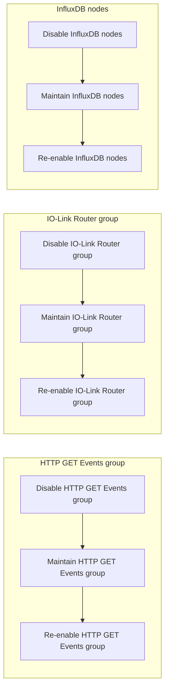

# Advanced Usage

This guide captures advanced operational patterns for the Industrial IoT data pipeline.

## Structured Log Rotation

* Trigger the **Log Reset** inject in the Node-RED editor to truncate JSON log files when storage must be reclaimed.
* Before resetting, archive the log directory defined by `LOG_DIRECTORY` for compliance review.
* Configure an operating system cron job or scheduled task to export the logs on a cadence aligned with plant retention policies.

## Adding New Gateways

1. Append new hosts to the gateway list in the configuration inject node (or externalize the list via environment variables).
2. Verify network reachability from the Node-RED runtime to each gateway (`ping`, `curl`).
3. Re-deploy the flow. The Config Loader automatically includes the new gateways in subsequent polls.

## Disabling Sub-flows

Use the Node-RED group toggles to isolate ingestion paths during maintenance. The diagram below outlines how to walk through the disable → maintain → re-enable steps for the **HTTP GET Events** group, the **IO-Link Router** group, and the **InfluxDB** nodes so you can quickly match each action to its swimlane in the editor.

* Use the Node-RED editor to disable the **HTTP GET Events** group (covers HTTP sub-flows shown above) when running in partial-connectivity environments.
* When MQTT connectivity is unavailable, disable the **IO-Link Router** group to avoid repeated connection attempts and follow the maintenance steps in the visualization before re-enabling the router.
* For maintenance windows, disable the **InfluxDB** nodes to prevent partial writes, complete any backend work outlined in the diagram, and re-enable the writers after the database recovers.

## Observability Enhancements

* Import the Grafana dashboard templates under `docs/developer/examples/sample_configs/` and customize thresholds for your plant.
* Enable InfluxDB task alerts to notify operators when gateway identification records stop updating.
* Mirror key metrics to a plant-specific MQTT topic for integration with SCADA or CMMS tools.

## Version Upgrades

* Export the running flow before applying changes to maintain a rollback path.
* Diff the new flow JSON against the prior release using `npx --yes json-diff`.
* Update `CHANGELOG.md` and `docs/architecture/data_flow.md` whenever flow behavior changes.
