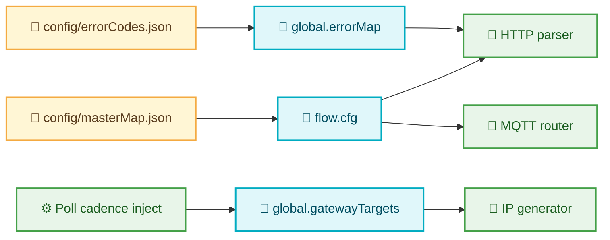

# Configuration Reference

This guide documents the runtime configuration objects and how to customize them for your deployment.

## Node-RED Context Variables

| Context | Purpose | Source |
| --- | --- | --- |
| `flow.cfg` | Maps IO-Link measurement aliases to simplified field names. | Loaded from `config/masterMap.json`. |
| `global.errorMap` | Resolves numeric gateway error codes to human-readable descriptions. | Loaded from `config/errorCodes.json`. |
| `global.gatewayTargets` | List of gateway IP addresses or hostnames to poll. | Populated by the `Poll cadence` inject node. |

The relationship diagram below shows how the configuration files feed each context variable and which flow groups consume them. Use it to verify that changes to a file or flow are reflected in every dependent context before deploying to production.

## Configuration Files

### `config/masterMap.json`

* Defines friendly aliases for IO-Link metrics (e.g., `temperaturePin1` → `temp_pin1`).
* Group entries by gateway and module to simplify downstream queries.
* Use the accompanying schema in `docs/developer/examples/sample_configs/schemas/masterMap.schema.json` to validate updates.

### `config/errorCodes.json`

* Enumerates event codes, severity, and recommended operator actions.
* Extend the dictionary when vendors introduce new firmware revisions or gateway types.
* Validation schema: `docs/developer/examples/sample_configs/schemas/errorCodes.schema.json`.

## Environment Variables

| Variable | Description | Default |
| --- | --- | --- |
| `CONFIG_BASE_PATH` | Overrides the directory that contains configuration files. | `./config` |
| `LOG_DIRECTORY` | Root folder for structured HTTP/MQTT logs. | `E:\\NodeRed\\Logs` |
| `POLL_INTERVAL_SECONDS` | Overrides the default 60-second HTTP poll cadence. | `60` |

## Grafana Dashboards

Reusable dashboard JSON templates live under `docs/developer/examples/sample_configs/`. Import them into Grafana to accelerate si
te deployments. Update data source names if your Grafana instance uses custom InfluxDB connections.

## Secrets Management

* Store InfluxDB tokens in a platform secret store when running Node-RED within Docker or Kubernetes.
* Configure the MQTT username/password via Node-RED environment variables or secure credentials file.
* Rotate all credentials quarterly and update the Node-RED config nodes accordingly.
